## What is Synacksync 


Synacksync is a project to sync the API endpoints for missions, patches, and upcoming projects on the Synack platform to a Google calendar. There is some light sanitization of the data to help mitigate any sensitive client data from being added to the calendar. 

This is not Synack supported but there is a **srt-aringos-synacksync** channel where you can ask a question or give feedback. 


## Why 
Many times I've been on a dog walk where a patch has expired. Also logged into Synack to see something no longer existed. With the loss of QR and dynamic pricing SRT are highly rewarded if they are first on a target. Hopefully this will give some SRT better situational awareness and let them see if they can fit checking a new launch into their schedule.   

Below is an example of what an upcoming view might look like on a calendar. 

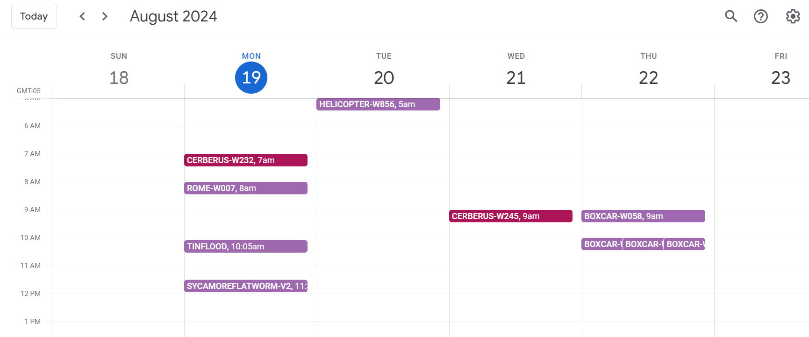


## Overview 

The script works by creating a Google project with an API restricted to calendar actions. Then a helper tool for using the API and interacting with the calendar called Gcaltool is installed. With a Synack auth token the user sets up and runs the sync script. Then share the calendar with any other Google account. Could even write their own app with Gcaltool and not even use another users calendar. If they want they set it up to run on an interval it should continue to work .. omitting any other issues.   

## Install 

#### Get an API key for Google Service
<details>
 <summary> Generating Google Service API credentials</summary>

## Setting Up Google Calendar API Credentials

Before using `gcaltool`, you need to set up a project in the Google Cloud Console and obtain the credentials required to access the Google Calendar API. You have to have use a service account or your creds will expire in days (so this is the way) just follow the directions and leave scope to only the Calendar API. 

### 1. Create a Google Cloud Project

1. With a Google account login to the [Google Cloud Console](https://console.cloud.google.com/).
2. Click on the **Select a project** dropdown at the top.
3. Click **New Project**.
4. Enter your project name and click **Create**.

### 2. Enable the Google Calendar API

1. In the Google Cloud Console, go to **APIs & Services > Library**.
2. Search for "Google Calendar API".
3. Click on **Google Calendar API** and **Enable**.

### 3. Create Service Account Credentials

1. Go to **APIs & Services > Credentials**.
2. Click **Create Credentials** and choose **Service Account**.

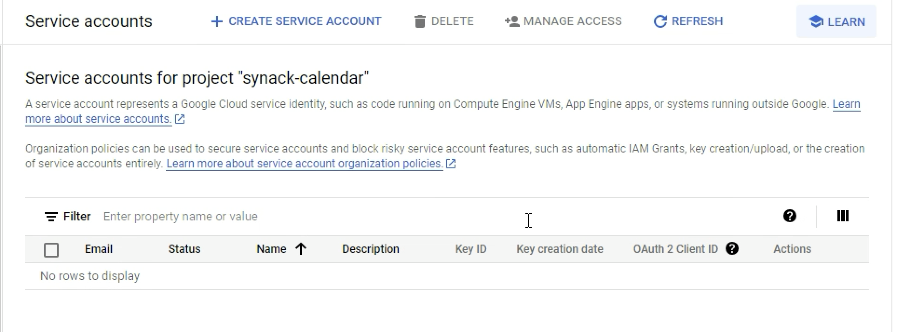
3. Enter a name for the service account and click **Create**.

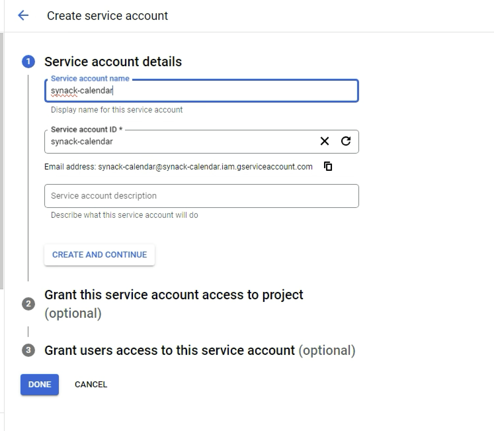
4. Assign a role to the service account (e.g., **Project > Editor**).

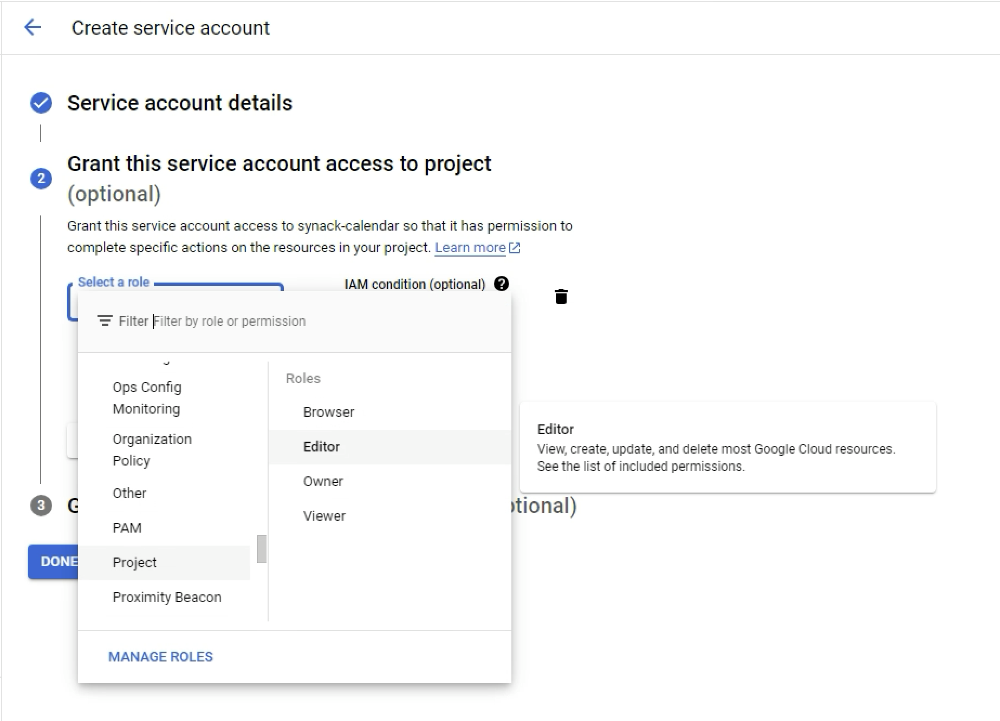
5. Continue until the service account is created.
6. On the **Credentials** page, click on the service account you just created.
7. Under the **Keys** tab, click **Add Key** > **Create New Key**.

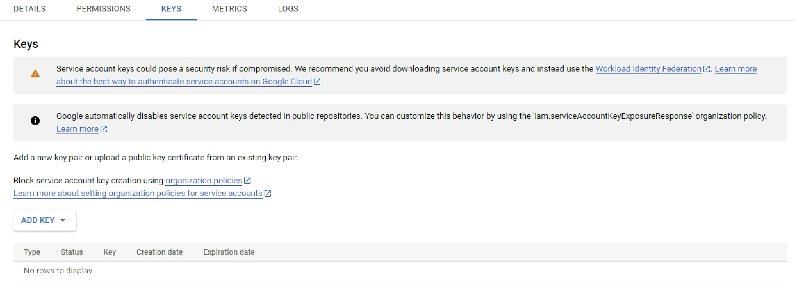
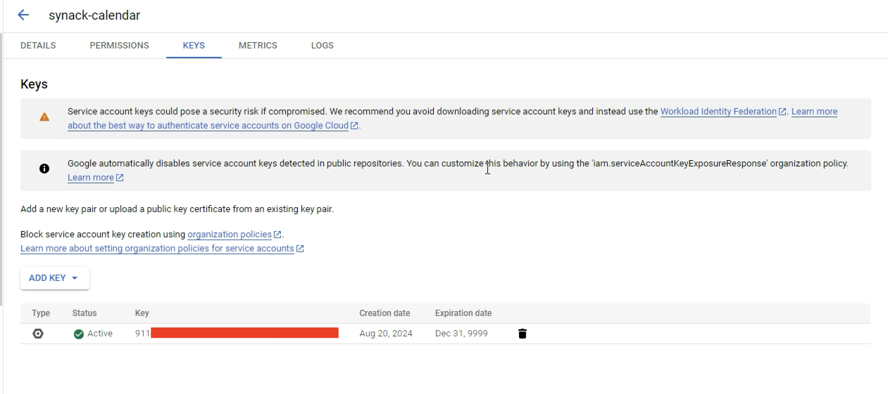

8. Choose **JSON** and click **Create**. You should have a JSON file containing your credentials.

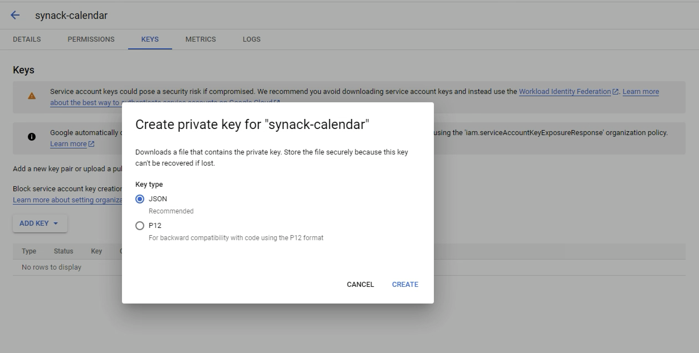


</details>


#### Set up Gcaltool to interact with the service
<details>
 <summary> Install and Configure Gcaltool</summary>

# gcaltool

 `gcaltool` is a command-line tool for managing Google Calendar events and calendars. This tool allows you to create, share, edit, and delete calendars and events directly from your terminal.
 Originally there was a great python library for working with Google Calendar but Google is on V3 API now and this required some other modifications so just rolled my own. 

## Features

- Create and manage Google Calendars.
- Add, edit, delete, and search events.
- Share calendars with other users.
- View upcoming events.
- Configure default calendar and service account file.

## Installation

To install `gcaltool`, you can use `pip`:

```bash
pip install .
```

## Getting Started with `gcaltool`

### 1. Set the Path to Your Service Account Credentials 
The first time you run `gcaltool`, you need to specify the path to your service account credentials:

```bash
gcaltool --set_service_account_file /path/to/your/service_account.json
```

This will store the path to your credentials in the configuration file.

### Configuration File Location

- **Windows**: `%APPDATA%\gcaltool\config.json`
- **Linux/Unix**: `~/.config/gcaltool/config.json`

### Example Configuration File

```json
{
    "service_account_file": "/path/to/your/service_account.json",
    "default_calendar_id": "your_calendar_id",
    "timezone": "America/Chicago"
}
```

Set the timezone manually or can update script to save it ..  

### Additional gcaltool functionality

Use `-h` and you can see the functionality, not going into it. It just uses the calendar_service.py which you can import and use in any of your own scripts. So calendar stuff and pretty easy to understand. 

The SynackSync scripts use this functionality to help programatically modify and update calendars for missions, patches, and upcoming targets. 

</details>

#### Get a token for the Synack API
<details>
 <summary> Authentication Token</summary>
To get your Synack token you can setup something like https://github.com/dinosn/synackDUO or for quick testing make a browser bookmark like below and then when authenticated just click the bookmark.

### SynackTokenToFile
Download to your default browser download location using this bookmarklet and set your downloads as the location for the file. Can modify the script to read the newest if you don't want to delete it.   
```
javascript:(function(){var token=sessionStorage.getItem('shared-session-com.synack.accessToken');if(!token){console.error('Token not found in session storage.');return;}var blob=new Blob([token],{type:'text/plain'});var url=URL.createObjectURL(blob);var a=document.createElement('a');a.href=url;a.download='synacktoken.txt';document.body.appendChild(a);a.click();document.body.removeChild(a);URL.revokeObjectURL(url);})();
```
### SynackTokenToClipBoard 
Copies Synack Token to the clipboard 
```
javascript:(function(){var token=sessionStorage.getItem('shared-session-com.synack.accessToken');if(!token){console.error('Token not found in session storage.');return;}var textarea=document.createElement('textarea');textarea.value=token;document.body.appendChild(textarea);textarea.select();document.execCommand('copy');document.body.removeChild(textarea);alert('Token copied to clipboard');})();
```
</details>


#### Setup the actual SynackSync script 

<details>
 <summary> Configure and Run SynackSync</summary>

 # SynackSync

SynackSync consists of individual scripts instead of something you install so that in the future if the API changes or you want to not use the calendar its hopefully pretty straightforward. 

## Setup 

The setup script will assist in creating the config that the application will utilize and create any calendars needed. Make sure to accept the calendar in your email when it shares calendars. 

## Python requirements 
As far as I know if you installed gcal its just this 
```
pip install time, pytz, requests, urllib, tzlocal
```
Then run the setup
```
python3 setup_synacksync.py
```

### Configuration File Location

- **Windows**: `%APPDATA%\synacksync\config.json`
- **Linux/Unix**: `~/.config/synacksync/config.json`

### Example config that should exist 

It creates it .. don't worry 
```json
{
    "base_url": "https://platform.synack.com",
    "authorization_token_path": "/tmp/synacktoken",
    "mission_calendar":"7a40372asdfsadfb40b7a6754becsdf5fc947350c2b30c22b2a2c6a@group.calendar.google.com",
    "patch_calendar":"7232e06casdfasdfsadfasdfasdfsadf2b5364fb30@group.calendar.google.com",
    "upcoming_calendar":"bcasdfasdfadsfasdfw3asdfafawefasdfsff13da@group.calendar.google.com",
    "database_path": "tasks.db"
}
```

Then you just run the script 
```
python3 synacksync.py
```
</details>

#### Keeping it running
<details>
  <summary> Windows - Persistence Instructions</summary>

These instructions are assuming WSL adjust accordingly if not

#### Open Task scheduler - search

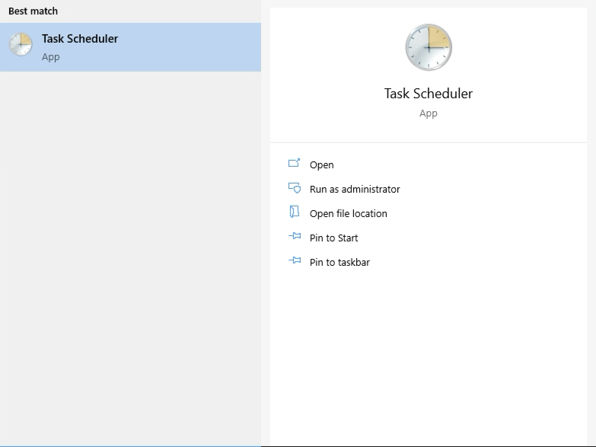

#### Create a Basic Task
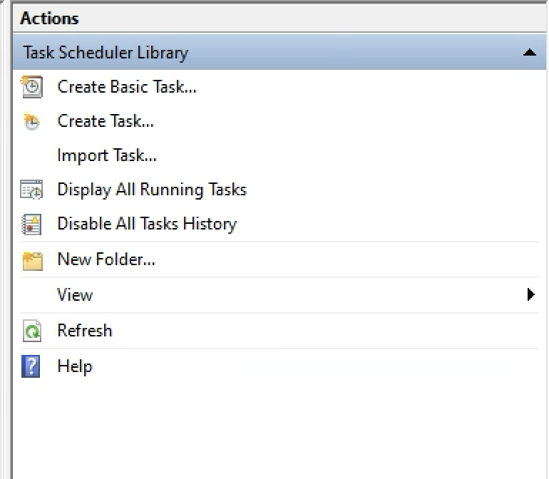

#### Set the Name 
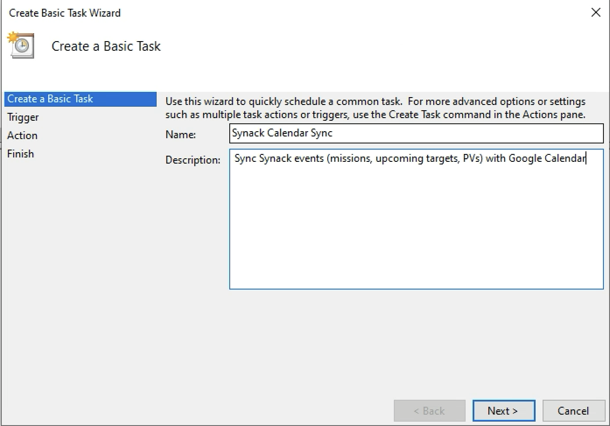

#### Set the Frequency
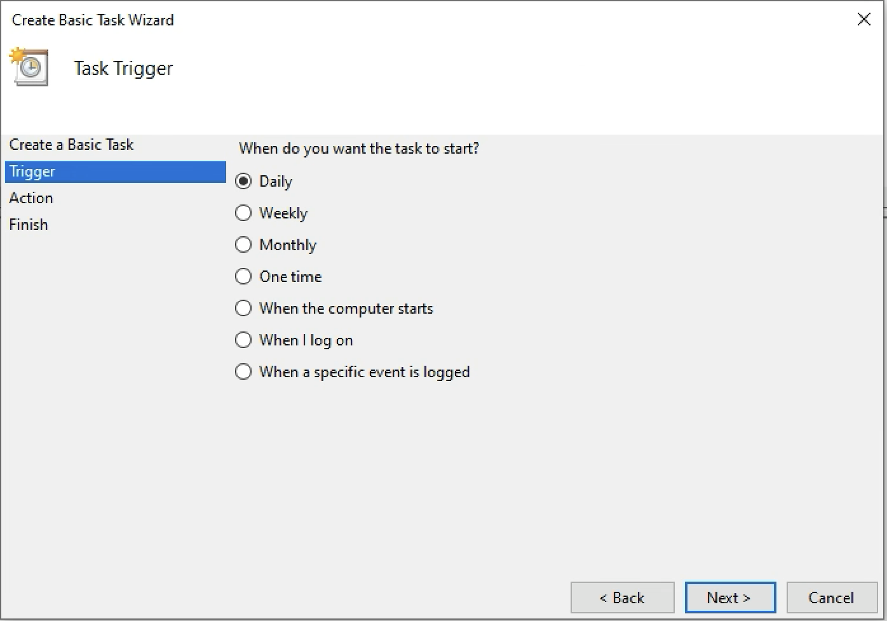

#### Put the initial schedule at one day 
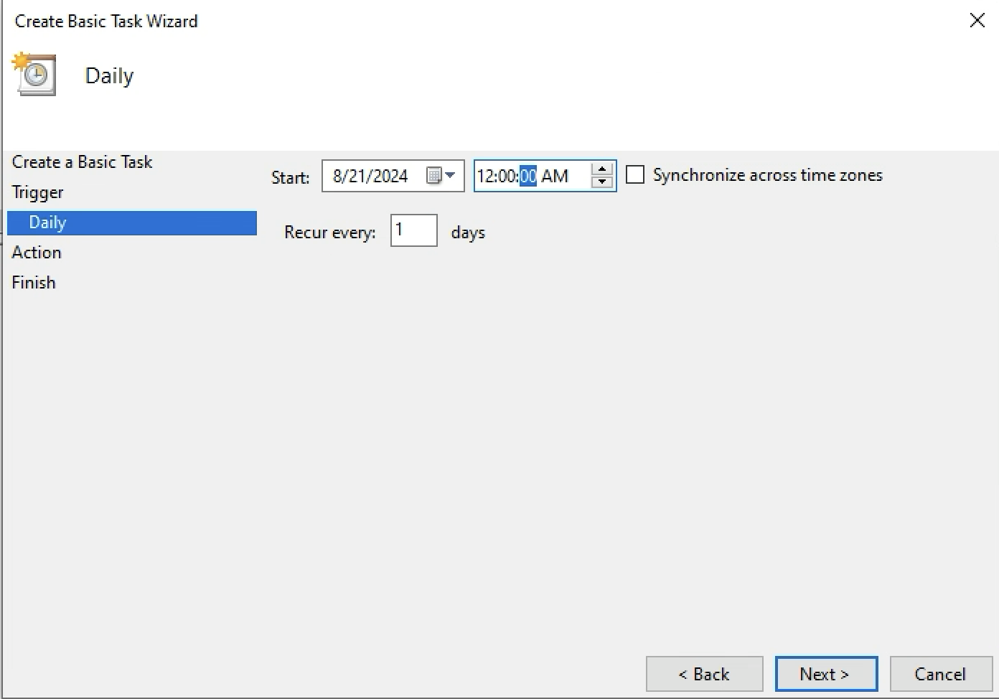

### set the script to be what runs 
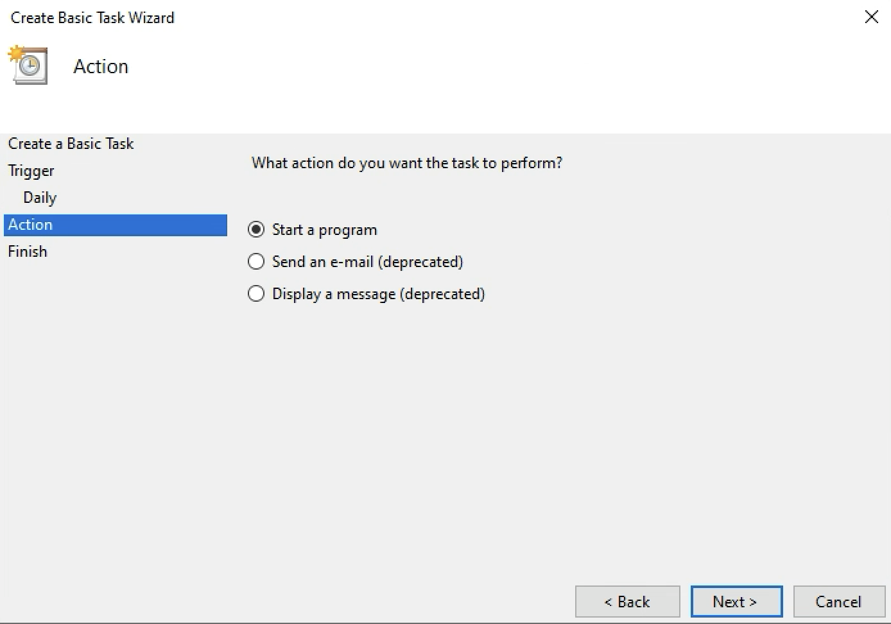

### Add with FULL PATH!!
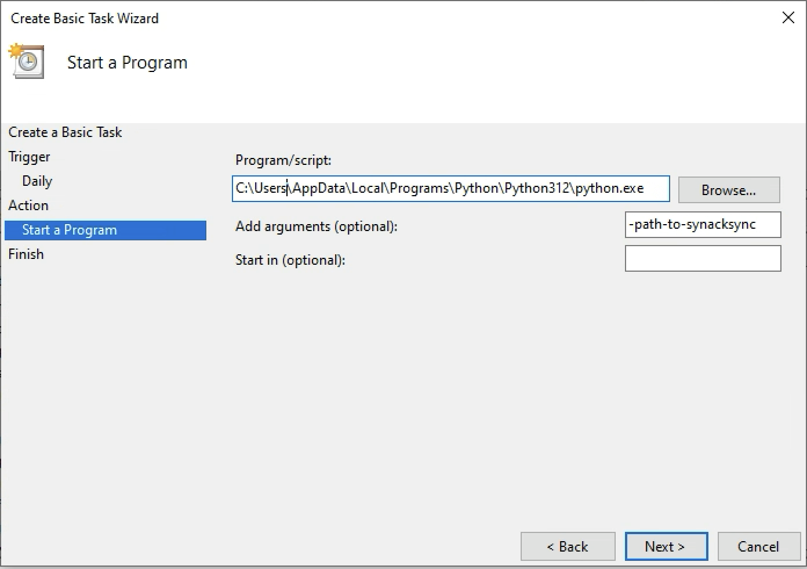

#### Finish and make sure to open the properties 
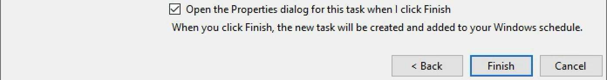


#### Edit the trigger for every two hours
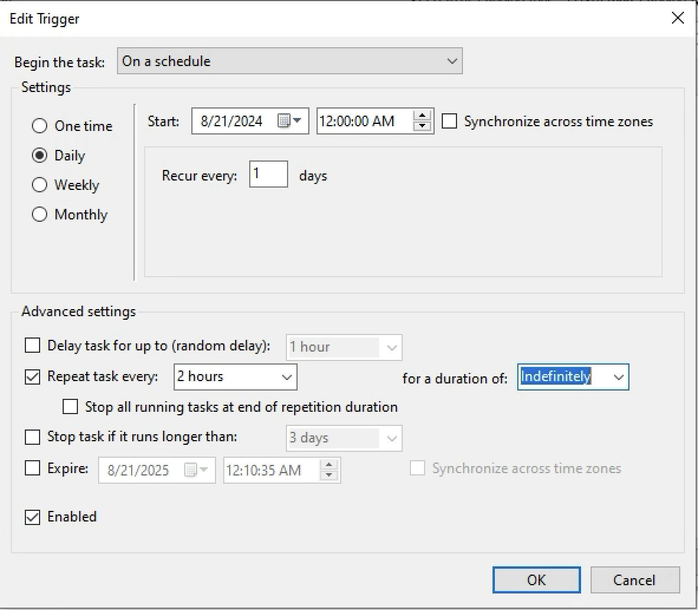

#### Set properties to run when the user is not logged on
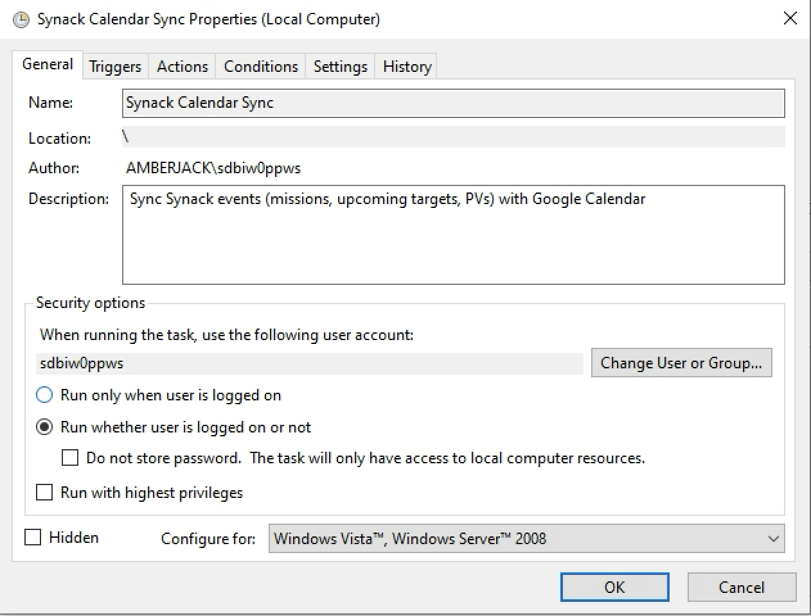

#### Review any running  
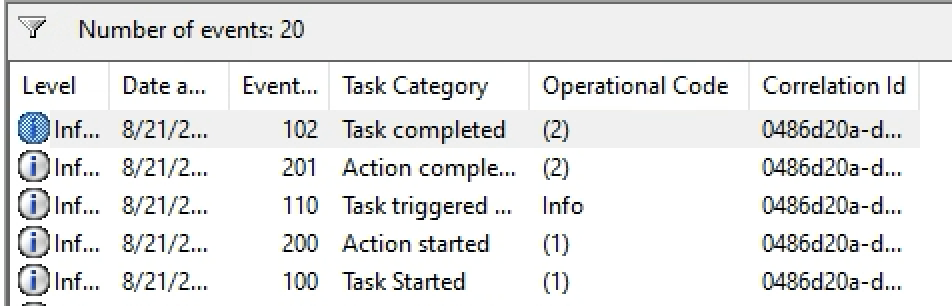


</details>

<details>
  <summary> Linux - Persistence Instructions</summary>


__Make sure you have a way to keep your authentication up to date__ and just add a cron. If you've never added a cron. 

### Step 1: Open the Crontab Editor
You can add a cron job by editing the crontab file using the following command:

```bash
crontab -e
```

This command opens the crontab editor for the current user.

### Step 2: Add the Cron Job
In the crontab editor, add the following line at the end of the file but change to the actual paths needed for the script location. The below is a two hour cron, omit the >> and everything after if you dont want logging:

```bash
0 */2 * * * /usr/bin/python3 /full_path_to_your_script/synacksync.py >> /full_path_to_where_you_want_to_log/synacksync.log 2>&1
```

### Step 3: Save and Exit
After adding the line, save the file and exit the editor. The method to save and exit depends on the text editor and if you are using VIM you might not be able to perform this step. (:wq)

### Step 4: Verify the Cron Job
You can verify that the cron job has been installed by listing your current cron jobs:

```bash
crontab -l
```

This command will display all the cron jobs set up for the current user. You should see the line you installed.


</details>

## License

This project is licensed under the MIT License or whatever. 

## Contributions


